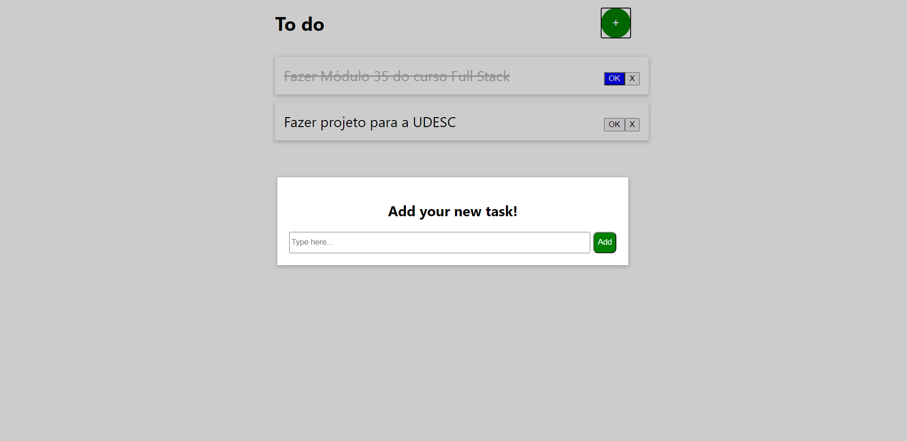

# To do List - React Js

* 9º projeto, feito em HTML, CSS, JavaScript e React Js.
* Projeto desenvolvido no curso Full Stack - ProgBr
* Projeto separado em componentes para melhor organização e utilização do código.
* Gerenciamento de estados utilizando React-Redux.
* Utilização do localStorage para armazenar os itens.